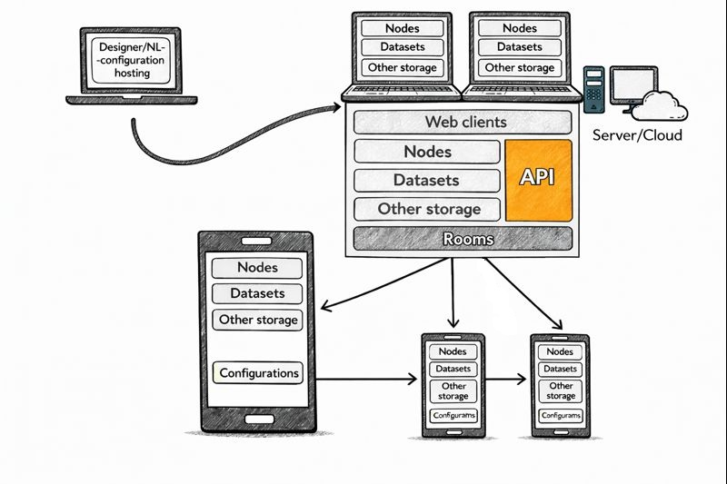

**NodaLogic** is a low-code business logic framework for creating client-server systems with mobile workstations. It implements architectural principles for creating systems of any complexity, consisting of identical blocks—nodes.

This system of Android apps and servers (which can be downloaded from this repository) allows you to create standalone apps with independent (offline) logic and storage. These apps can optionally work with a shared server(s) or simply run independently.

This approach enables the creation of solutions in the areas of WMS, TMS, MES, and more.

The solution logic is contained in a configuration (.nod file), which can be created in the cloud editor https://nmaker.pw/ (or downloaded from this repository and deployed). A device can simultaneously run multiple configurations, and a server can also run multiple configurations. Configurations are updated and transferred instantly over the air or offline, as files.

The typical operating scenario assumes that the device, after receiving its configuration, operates in hybrid mode (receiving data, references, and tasks) independently of the server and supplies information as needed and available. However, it can also operate in purely online mode.

NodaLogic pursues two goals:

* to become the most convenient architecture and semantics for LLM generation, enabling one-shot results even with weak models;
* to become a system where even complex solutions are compact, easy to read, and transparent to the developer. This means that the developer can easily understand what the neural network has created. And these aren't flowcharts with arrows, but classes with methods.

This is facilitated by semantics, compact documentation (the full documentation for LLM with patterns and examples is 2,000 lines long, which is not much for a UI/UX and client-server system), markup principles, and, most importantly, the node principle. After all, if LLM can create one node, it can create 1,000 nodes, which, like building blocks, can be used to create a system of any complexity.

Generation is conveniently integrated into the designer – essentially, any solution can be created using prompts and clarifying prompts without touching the code. A fairly simple principle is used for this: the prompt is combined with a special documentation file, LLM.txt, from this repository (by the way, this file is designed to be continually enriched by experience from vibecoding; commits are welcome!) and the current configuration and sent to LLM. The response is then validated against NodaLogic, sent back for revision automatically if necessary, and if everything is OK, the solution is automatically integrated into the configuration, allowing you to see it in action right away.

.. image:: static_readme /LLM.jpeg
       :scale: 70%
       :align: center

You can deploy it locally, enter your API key, and work. You can also work with LM Studio locally via the API, but keep in mind that it's best to choose more powerful models – at least 30b parameters.

.. image:: static_readme /generation.png
       :scale: 70%
       :align: center

The foundation of the system and the unified approach to designing client and server solutions is the "node." This is both a storage aspect (essentially NoSQL) and a class object with methods, including methods for visualization, node display, and any logic. A node interacts with other nodes through method calls and APIs (each node class automatically has an API for remote interaction). Thus, the solution is a "network of nodes," similar to a network of neurons. A node can be a business entity, an accounting entity, or a process.

.. image::  static_readme /nodes.png
       :scale: 70%
       :align: center

Here are some examples of node classes:

* Nodes of the "Warehouse" class have child nodes of the "Warehouse Cell" class, which have methods for storing balances. Incidentally, for calculating balances, the platform uses mechanisms such as "Amount Transaction" and "State Transaction"—a kind of "mini blockchain" that stores the chain of transactions in a node and the calculated total generated by those transactions. Each new transaction changes the outcome and is written into the chain with its own hash.
* A "Task" that generates subtask nodes as it executes, influencing other tasks.
* A "Document" that has row nodes, each of which can have its own row nodes.

.. image:: static_readme /android.png
       :scale: 70%
       :align: center

The UI/UX (mobile) approach is based on dynamically generating forms from code and subscribing to form events and general system events. Easy-to-read line markup is used. Container markup is also available.

Handlers are written in Python, but it is an open architecture, and there are plans to expand the list of interpreted languages ​​for handlers. At a minimum, JavaScript will be supported.

.. image:: static_readme /markdown.png
       :scale: 70%
       :align: center

In addition to nodes, you can also use other entities to store and synchronize data with external systems:

* "datasets" (immutable data from external systems (directories, links) designed for high performance and deeply integrated into the platform's UI/UX mechanisms, so that out-of-the-box access to the entire set of elements—input fields, tables, synchronization, search, indexing, etc.)—is available.
* standard SQLite storage
* NOSQL Pelican

Links:

Cloud builder: https://nmaker.pw/

Documentation (en): https://nodatxt.readthedocs.io/en/latest/

Documentation (ru): https://nodalogic-txt-ru.readthedocs.io/ru/latest/

Android app (apk file): https://disk.yandex.ru/d/jlMVqF9hIea_ig

Android app (store): https://play.google.com/store/apps/details?id=com.dv.noda&pcampaignid=web_share and https://www.rustore.ru/catalog/app/com.dv.noda

What's in this repository and installation:

In this repository, you can download either the builder+server version (exactly the same as https://nmaker.pw/) or the server-only version (and configure it elsewhere).

Installation is the same in either case:

1. download the folder (you can change the constants: DEEPSEEK_API_KEY, current_user.email)
2. pip install -r requirements.txt
3. python3 app.py (appserver.py)

